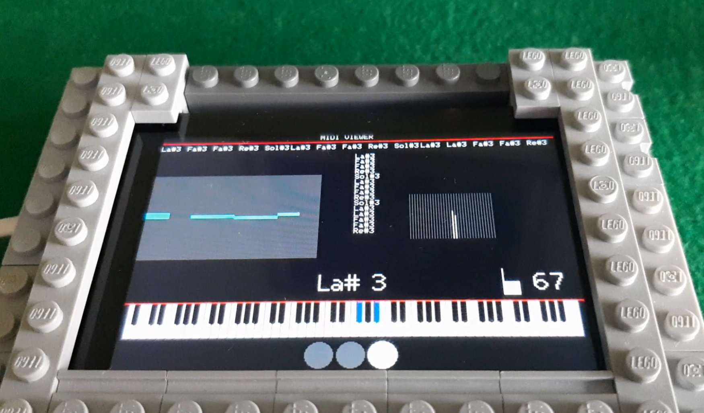

# 🎹 MIDI Project

A collection of modules dedicated to MIDI connection (Yamaha YDP 165 (Or another model with USB TO HOST port)

<p align="center">
  
</p>

## 📂 Project Structure

Yamaha piano <= USB => YAHOST (ESP32 S3 R8 ) <= Bluetooth => ... <= Bluetooth => YAMIDI (ESP32 with TFT screen)

### 1 - 🖥️ YAHOST

This is the USB HOST

Yamaha piano <= USB => YAHOST (ESP32 S3 R8 ) <= Bluetooth => ...


Repository:

https://github.com/kivoxo/midi/tree/7d89e57dc790e74c447e0aa47fcdb221d73f517f/yahost

---

## 🚀 Installation

Clone the repository:

```bash
git clone https://github.com/kivoxo/midi.git
cd midi
```
Build and upload to ESP32 S3 R8 using "Arduino IDE"


### 2 - 🎵 YAMIDI
... <= Bluetooth => YAMIDI (ESP32 with TFT screen)

Client MIDI Viewer

Repository:

https://github.com/kivoxo/midi/tree/7d89e57dc790e74c447e0aa47fcdb221d73f517f/yamidi

---

Build and upload to  using "ESPRESSIF IDE"

## 📦 Modules

| Module | Description |
|---------|-------------|
| YAMIDI | MIDI USB HOST |
| YAHOST | VIEWER |

## 🔗 Useful Links

- YAMIDI: https://github.com/kivoxo/midi/tree/7d89e57dc790e74c447e0aa47fcdb221d73f517f/yamidi
- YAHOST: https://github.com/kivoxo/midi/tree/7d89e57dc790e74c447e0aa47fcdb221d73f517f/yahost

## 📄 License

Distributed under GPL 3.0
